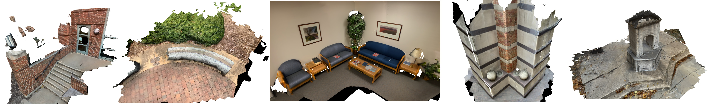

[](https://opensource.org/licenses/Apache-2.0)

<h1 align="center">Initialization and Alignment <br>for Adversarial Texture Optimization</h1>
<p align="center"><b>ECCV 2022</b></p>


<p align="center">
  
</p>

**Initialization and Alignment for Adversarial Texture Optimization. ECCV 2022.**<br>
[Xiaoming Zhao](https://xiaoming-zhao.com/), [Zhizhen Zhao](https://zhizhenz.ece.illinois.edu/), and [Alexander G. Schwing](https://www.alexander-schwing.de/).

### [Project Page](https://xiaoming-zhao.github.io/projects/advtex_init_align/) | [Paper](https://arxiv.org/abs/2207.14289)

## Table of Contents

- [Environment Setup](#environment-setup)
- [UofI Texture Scenes](#uofi-texture-scenes)
- [Compile TexInit](#compile-texInit)
- [Train and Evaluate UofI](#train-and-evaluate-uofi)
- [Train and Evaluate ScanNet](#train-and-evaluate-scannet)
- [Citation](#citation)

## Environment Setup
```
conda env create -f environment.yaml
```

We set the following environment variables for later usage:
```bash
cd /path/to/this/repo
CODE_ROOT=$PWD
export TEX_INIT_DIR=${CODE_ROOT}/advtex_init_align/tex_init

export THIRDPARTY_DIR=${CODE_ROOT}/third_parties
mkdir -p ${THIRDPARTY_DIR}
```

And we use `scene_04` as an example in this README:
```bash
export SCENE_ID=scene_04
```

### PyTorch3D

We rely on [PyTorch3D](https://github.com/facebookresearch/pytorch3d) for rendering and rasterization. Please follow [the official instruction](https://github.com/facebookresearch/pytorch3d/blob/d07307a/INSTALL.md) to build it from source:
```bash
conda install -c conda-forge -c fvcore fvcore
conda install -c bottler nvidiacub

cd ${THIRDPARTY_DIR}
git clone https://github.com/facebookresearch/pytorch3d.git
cd pytorch3d && git checkout d07307a

pip install -e . --verbose
```

## UofI Texture Scenes

We self-collect data with an iOS App developed based on [ARKit](https://developer.apple.com/augmented-reality/) (XCode 13.1). Please download and uncompress [the dataset](https://drive.google.com/drive/folders/1aSI37AJPbynCoN8DapfYIaqCQn7ZDt3z?usp=sharing) and place it under `${TEX_DIR}/dataset/uofi`. The structure should be:
```
.
+-- dataset
|  +-- uofi
|  |  +-- scene_01
|  |  +-- scene_02
|  |  ...
```

### Data Reader

The data is in binary format and consists of information for RGB, depth, camera matrices, and mesh. We provide a [Python script](./advtex_init_align/data/bin_data_reader.py) to read data from it. Run the following command:

```bash
export PYTHONPATH=${CODE_ROOT}:$PYTHONPATH && \
python ${CODE_ROOT}/advtex_init_align/data/bin_data_reader.py \
--stream_dir ${CODE_ROOT}/dataset/uofi/${SCENE_ID} \
--save_dir ${CODE_ROOT}/dataset/extracted/${SCENE_ID}
```

The extracted data will be saved with structure:
```
.
+-- dataset
|  +-- extracted
|  |  +-- scene_04
|  |  |  +-- mesh.ply  # file
|  |  |  +-- rgb       # folder
|  |  |  +-- depth     # folder
|  |  |  +-- mat       # folder
```

We provide [a notebook](./advtex_init_align/data/demo.ipynb) to illustrate the format of the extracted data.

## Compile TexInit

The code has been tested on Ubuntu 18.04 with GCC 7.5.0.

### Install Dependencies

1. Install dependencies from Package Manager:

```bash
sudo apt-get install libmetis-dev libpng-dev libsuitesparse-dev libmpfr-dev libatlas-base-dev liblapack-dev libblas-dev
```

2. Manually install [Eigen3.4](https://gitlab.com/libeigen/eigen/-/tree/3.4):
```bash
cd ${THIRDPARTY_DIR}
wget https://gitlab.com/libeigen/eigen/-/archive/3.4/eigen-3.4.zip
unzip eigen-3.4.zip
```

3. Manuall install [Boost 1.75.0](https://www.boost.org/doc/libs/1_75_0/more/getting_started/unix-variants.html). Please follow [the official instruction](https://www.boost.org/doc/libs/1_75_0/more/getting_started/unix-variants.html) to install Boost:
```bash
cd ${THIRDPARTY_DIR}
wget https://boostorg.jfrog.io/artifactory/main/release/1.75.0/source/boost_1_75_0.tar.bz2
tar --bzip2 -xf boost_1_75_0.tar.bz2

mkdir -p ${THIRDPARTY_DIR}/boost_1_75_0/build
cd ${THIRDPARTY_DIR}/boost_1_75_0/
./bootstrap.sh --prefix=${THIRDPARTY_DIR}/boost_1_75_0/build
./b2 install
```

4. Manually install [CGAL 5.1.5](https://github.com/CGAL/cgal). Please follow [the official instruction](https://doc.cgal.org/5.1.5/Manual/installation.html):
```bash
cd ${THIRDPARTY_DIR}
wget https://github.com/CGAL/cgal/releases/download/v5.1.5/CGAL-5.1.5.zip
unzip CGAL-5.1.5.zip
cd ${THIRDPARTY_DIR}/CGAL-5.1.5 && mkdir install && mkdir build && cd build
cmake -DCGAL_HEADER_ONLY=OFF -DCMAKE_BUILD_TYPE=Release -DCMAKE_INSTALL_PREFIX=../install ..
make
make install
```

### Compile

Modify the [Makefile](./advtex_init_align/tex_init/Makefile) based on your setup:
- Set the variable `THIRDPARTY_DIR` to the value of `${THIRDPARTY_DIR}`;
- Set the variable `CUDA_ROOT` to your CUDA's root directory, e.g., `/usr/local/cuda-11.1`.

Then use the following command to compile TexInit execution file:
```bash
cd ${TEX_INIT_DIR}
make tex_init DEBUG=0 -j 8
```

## Train and Evaluate UofI

### Train

We provide [run.sh](./run.sh) to illusrtate the overall pipeline. The following command will generate texture in `${CODE_ROOT}/experiments/uofi/${SCENE_ID}/optimized_texture_test_1_10`, which can be directly used in 3D rendering engine, e.g., [Blender](https://www.blender.org/) and [MeshLab](https://www.meshlab.net/).
```bash
bash ${CODE_ROOT}/run.sh \
  ${CODE_ROOT} \
  ${SCENE_ID} \
  run_train
```

### Evaluate

The following command will compute and save quantitative results in `${CODE_ROOT}/experiments/uofi/${SCENE_ID}/test_1_10/eval_results`.

```bash
bash ${CODE_ROOT}/run.sh \
  ${CODE_ROOT} \
  ${SCENE_ID} \
  run_eval
```

## Train and Evaluate ScanNet

Download ScanNet raw data from the [website](http://www.scan-net.org/). Place them under `${TEX_DIR}/dataset/scannet_raw` with structure:
```
.
+-- dataset
|  +-- scannet_raw
|  |  +-- scene0000_00
|  |  |  +-- scene0000_00.sens  # file
|  |  |  ...
|  |  +-- scene0001_00
...
```

We use `scene0016_00` as an example:
```bash
export SCENE_ID=scene0016_00
```

### Train

We provide [run_scannet.sh](./run_scannet.sh) to illusrtate the overall pipeline. The following command will generate texture in `${CODE_ROOT}/experiments/scannet/${SCENE_ID}/optimized_texture_test_1_10`, which can be directly used in 3D rendering engine, e.g., [Blender](https://www.blender.org/) and [MeshLab](https://www.meshlab.net/).

Note, since ScanNet's scenes contain thousands of high-resolution images, the processing time will be much longer than that of UofI Texture Scenes.
```bash
bash ${CODE_ROOT}/run_scannet.sh \
  ${CODE_ROOT} \
  ${SCENE_ID} \
  run_train
```

### Evaluate

The following command will compute and save quantitative results in `${CODE_ROOT}/experiments/scannet/${SCENE_ID}/test_1_10/eval_results`.

```bash
bash ${CODE_ROOT}/run_scannet.sh \
  ${CODE_ROOT} \
  ${SCENE_ID} \
  run_eval
```

## Citation
>Xiaoming Zhao, Zhizhen Zhao, and Alexander G. Schwing. Initialization and Alignment for Adversarial Texture Optimization. ECCV 2022.
```
@inproceedings{zhao-tex2022,
  title = {Initialization and Alignment for Adversarial Texture Optimization},
  author = {Xiaoming Zhao and Zhizhen Zhao and Alexander G. Schwing},
  booktitle = {Proc. ECCV},
  year = {2022},
}
```

## Acknowledgements

- We build on [Adversarial Texture Optimization](https://github.com/hjwdzh/AdversarialTexture).
- Mesh flattening code is adopted from [boundary-first-flattening](https://github.com/GeometryCollective/boundary-first-flattening).
- Markov Random Fields solver comes from [GSPEN](https://github.com/cgraber/GSPEN).
- S3 metrics is adopted from [author's implementation](https://sites.google.com/site/cuongvt101/research/Sharpness-measure).